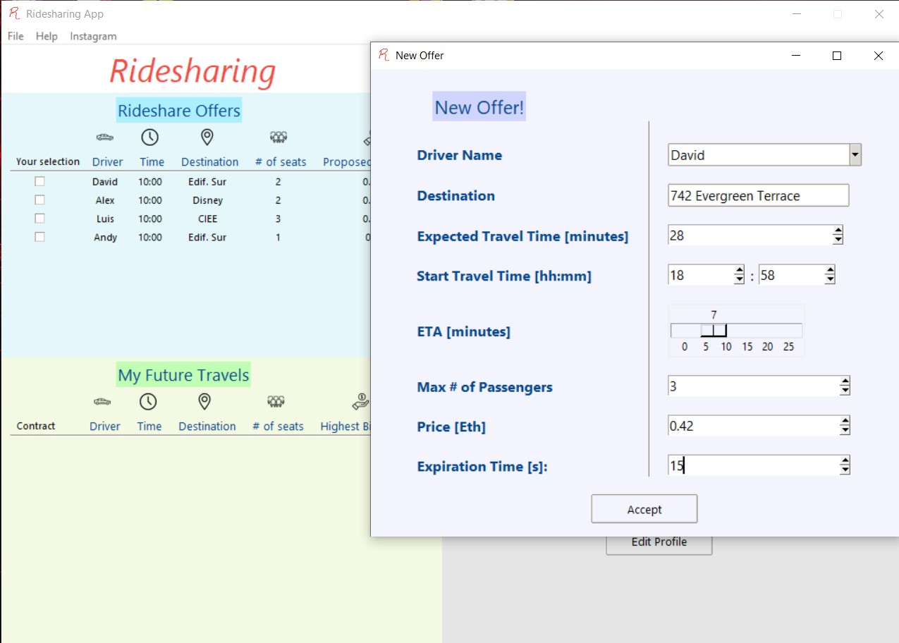
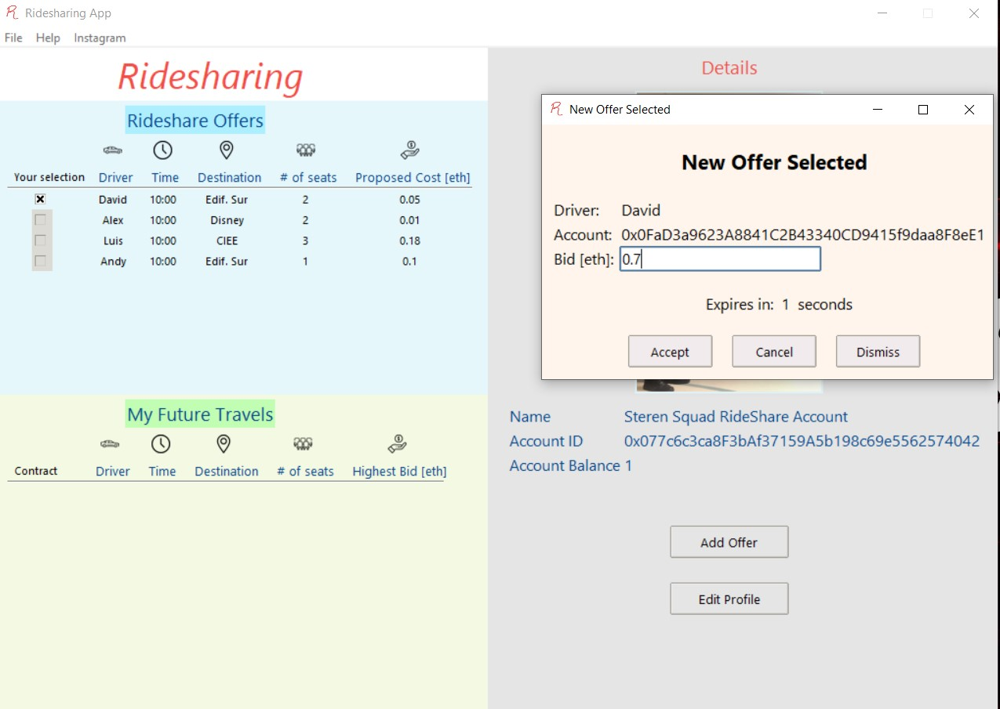
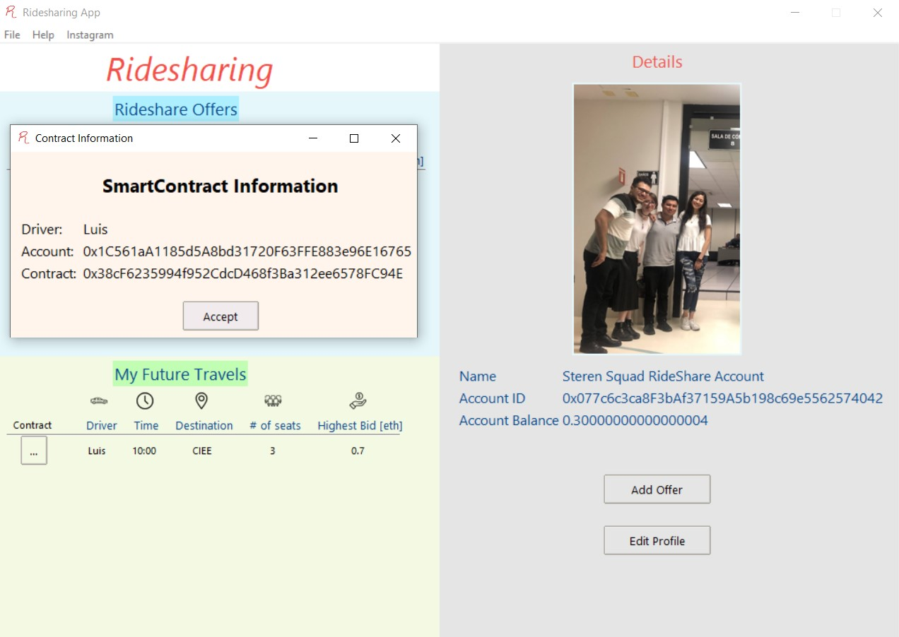
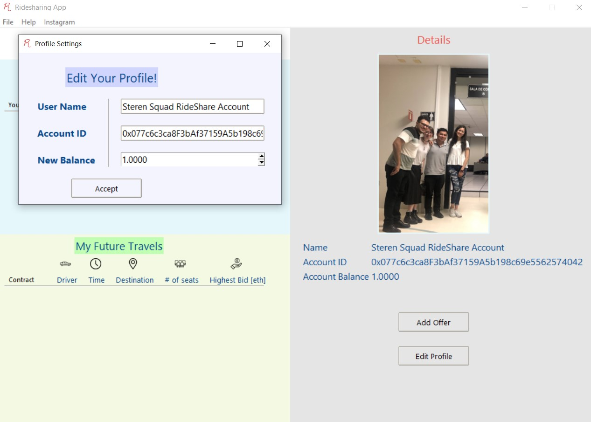
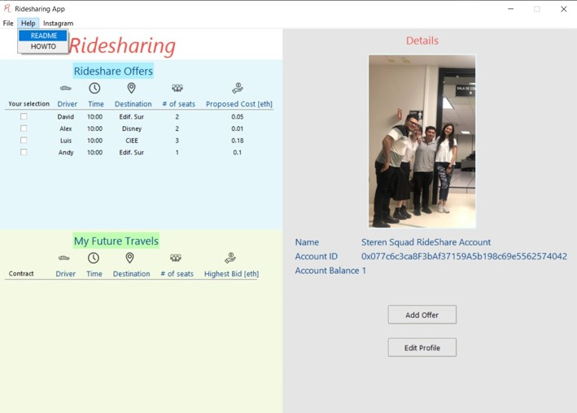

# RideShare: Blockchain solution to our riding problems
## Cryptology and Security Tools Final Project
---

## 1. About the project
RideSharing is an application that assists in making deals between drivers and clients without a middleman in order to ensure both sides have a fair opportunity in the terms of thesee deals. Instead of using a traditional payment method such as cash or credit/debit cards, RideSharing allows transactions using blockchain and smart contracts technologies. The transactions are executed in a bidding format and use the Ether crypto asset as their currency.

### Built with
- Python
- Ganache
- Solidity

## 2. Getting started
The RideSharing App is majorly developed in Python. However, additional technologies such as Solidity and Ganache are used to set up the Ethereum environment for the transactions. 

### Prerequisites
- Previous installation of Python and a programming environment (ex. VS Code)
      https://code.visualstudio.com/download
      
- Previous installation of Ganache Blockchain environment
      https://trufflesuite.com/ganache/
      

### Installation
Compilation process How-to (Python)

1. Download all the files in this repository
2. Open terminal CMD
3. Verify Python is installed 
      >python --version
4. Go to the path to which the files were downloaded by typing
      >cd PATH Example: "cd C:\Users\student\Documents\ITESM\CryptoProject"
5. Install required libraries by typing
      >pip install -r requirements.txt
6. Verify the installation by typing
      >pip freeze 
7. Check if the installed dependencies match the requirements.txt file
8. Run the file by typing
      >python "PATH\RideSharing.py" 
      >Example: python "C:\Users\student\Documents\ITESM\RideSharing.py"
The Graphical User Interface will then start.

IMPORTANT NOTE - The app will only run properly if a Ganache Workspace has already been created and is running alongside the app.

## 3. Usage
This application uses the benefits of Blockchain and SmartContracts to make transactions without a middleman to make deals between drivrs and clients!

Some of its functionalities are:

### 
### Posting Offers as a Driver!

### Making Bids to take one of the available Offers!

### Keeping Track of the Smart Contracts related to the Transaction!

### Edit Your Profile!

### Access the README and HOWTO files at any moment

### Follow the Developers on Instagram

## 4. Roadmap

- [X] Deliverable # 1 - MOC of User Interface
- [X] Deliverable # 2 - System Infrastructure
- [X] Deliverable # 3 - Exam Workshop

### Developed by Steren Squad

| Name | ID | Account |
| ----------- | ----------- | ----------- |
| Frida Sofía Sosa Luviano  | A01650483  | [sofisoluv99](https://github.com/sofisoluv99) |
| Jorge Alejandro López Apresa | A01376543 | [AlexLA26](https://github.com/AlexLA26)  |
| Danya Ortega Cabrera | A01339201 | [DanyaOC](https://github.com/DanyaOC) |
| Hugo René Pérez Cabrera | A01337226 | [Hugondon](https://github.com/Hugondon)  |
---

## Special Thanks

Clock icon created by Those Icons - Flaticon

Location icons created by Freepik - Flaticon

Money icons created by Freepik - Flaticon

Seats icons created by Freepik - Flaticon

Car icons created by Freepik - Flaticon
